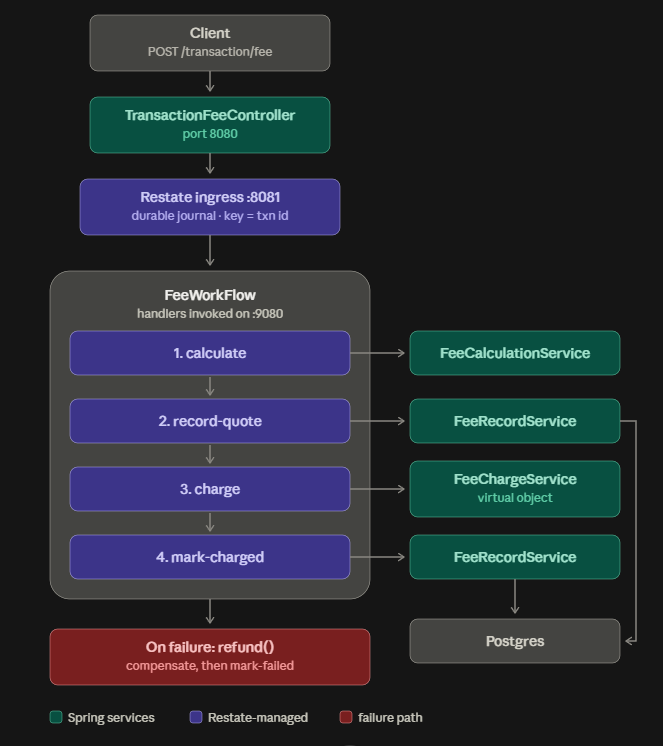

# Cashi Fees Service

A RESTful fees workflow for the Cashi backend challenge: a transaction is submitted to a public                                                                                                                                   
endpoint, and its fee is **calculated, charged and recorded** as a single durable                                                                                                                                                 
[Restate](https://restate.dev/) workflow.

The workflow is keyed by `transaction_id`, so submitting the same transaction twice charges it                                                                                                                                    
once — even if the app crashes halfway through.

## Run

```bash
docker compose up --build
```

then call the api with a transaction body

```bash
curl -X POST http://localhost:8080/transaction/fee \
  -H 'content-type: application/json' \
  -d '{
    "transaction_id": "txn_001",
    "amount": 1000,
    "asset": "USD",
    "asset_type": "FIAT",
    "type": "Mobile Top Up",
    "state": "SETTLED - PENDING FEE",
    "created_at": "2023-08-30 15:42:17.610059"
  }'
```

Swagger UI is at <http://localhost:8080/swagger-ui/index.html> with the request body                                                                                                                                              
pre-populated, and the Restate UI at <http://localhost:9070>

## Architecture



## Configurations

You can add more transaction types rules in the **application.yml** file

For the sake of the demo I kept the rules in config. In a real system I would put them in a                                                                                                                                       
`fees_config` table and cache them, invalidating on a CDC event rather than a TTL, so a pricing                                                                                                                                   
change does not need a deploy and does not go stale for five minutes.

```yml
cashi:
  fees:
    rules:
      "[Mobile Top Up]":
        type: PERCENTAGE
        rate: 0.0015
        description: "Standard fee rate of 0.15%"

      "[Bill Payment]":
        type: PERCENTAGE
        rate: 0.0020
        description: "Standard fee rate of 0.20%"
```

## Tests

Make sure the Docker daemon is running — the Restate tests use Testcontainers.

```bash
  ./gradlew test --tests 'com.cashi.fees.*'
```

## Open Questions
1. are amounts represented as minor or major units ?

I treated them as major units — `1000` USD at 0.15%                                                                                                                                      
gives a fee of `1.50`, which matches the expected response in the brief

2. can a transaction amount be zero ??

I assumed no, and reject `0` and negatives with a 400

3. what do I mean by charging step ??

With no wallet or account in the contract, I read it                                                                                                                                    
as charging against the same transaction record by charge id and state changing.

## Resources

[Bealdung for Kotlin](https://www.baeldung.com/kotlin/)

[Restate Docs](https://restate.dev/)